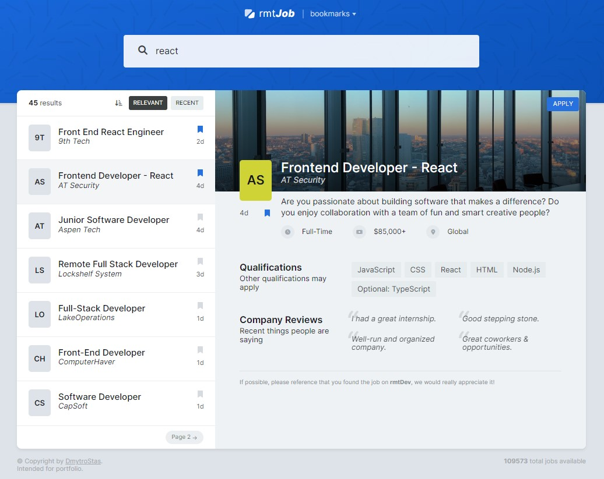

# rmtJob

## Overview

Individual project

Discover a complete platform built for remote opportunities that connect you to various remote IT development roles. Easily view, apply and bookmark job postings from your home. Advance your career with our convenient remote job search app.

## Features

- React-Query
- Saving data to local storage for bookmarks
- Context API
- Pagination
- Data sorting
- Responsive design for optimal viewing on different devices

## Technologies Used

##

> Developed by Dmytro Stas

